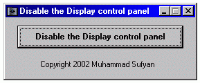



## Disable/Enable Display control panel

### Description

Disable/Enable the Display control panel so when you right-click on the desktop and choose Properties or when you go to control panel and choose Display, it will restrict showing the display dialog so you cant make changes to the system current settings.
 
### More Info
 

             |
---                |---
**Submitted On**   |2002-08-08 05:10:16
**By**             |[Muhammad Sufyan](https://github.com/Planet-Source-Code/PSCIndex/blob/master/ByAuthor/muhammad-sufyan.md)
**Level**          |Intermediate
**User Rating**    |3.5 (14 globes from 4 users)
**Compatibility**  |VB 6\.0
**Category**       |[Registry](https://github.com/Planet-Source-Code/PSCIndex/blob/master/ByCategory/registry__1-36.md)
**World**          |[Visual Basic](https://github.com/Planet-Source-Code/PSCIndex/blob/master/ByWorld/visual-basic.md)
**Archive File**   |[Disable\_En115482872002\.zip](https://github.com/Planet-Source-Code/muhammad-sufyan-disable-enable-display-control-panel__1-37714/archive/master.zip)

